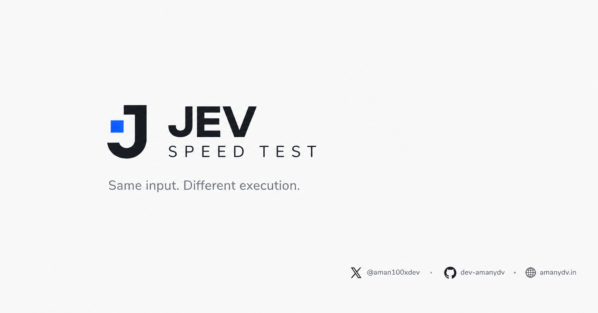

<div align="center">

  # JEV Speed Test ⚡

  **An interactive, developer-grade performance benchmark comparing structured evaluation speed and economics between Jev (`typesafe-ai/jev`) and traditional sequential LLM chains.**

  <p align="center">
    <a href="https://jev-speedtest.amanydv.in"></a>
    <a href="https://nextjs.org"></a>
    <a href="https://react.dev"></a>
    <a href="https://www.typescriptlang.org"></a>
    <a href="https://tailwindcss.com"></a>
    <a href="https://bun.sh"></a>
    <a href="./LICENSE"></a>
  </p>

  <p align="center">
    <a href="https://jev-speedtest.amanydv.in"><b>Explore Live Benchmark »</b></a>
    &nbsp;&nbsp;•&nbsp;&nbsp;
    <a href="https://github.com/dev-amanydv/jev-speedtest"><b>GitHub Repository »</b></a>
    &nbsp;&nbsp;•&nbsp;&nbsp;
    <a href="https://amanydv.in"><b>Author Portfolio »</b></a>
    &nbsp;&nbsp;•&nbsp;&nbsp;
    <a href="https://x.com/aman100xdev"><b>Follow on X »</b></a>
  </p>

</div>
  


> **Same input → identical decisions → 10× faster execution → measurable latency and token cost reduction.**

---

## 🔭 Overview

When building production AI agents, automated triage pipelines, and structured decision engines, developers frequently face an architectural bottleneck: **evaluating multiple structured decisions sequentially using traditional LLM chains**. 

Each decision requires a dedicated network roundtrip, passes repetitive context, incurs token generation overhead, and compounds latency. A workflow requiring 6 discrete classifications can easily take **7,000 to 9,000 milliseconds**.

**JEV Speed Test** demonstrates how **Jev (`typesafe-ai/jev`)** solves this problem. By compiling arbitrary structured decision schemas into a **single parallel evaluation request** using the Vercel AI SDK (`experimental_evaluate`), Jev resolves all decisions simultaneously in **~580–640ms** — delivering a **10× to 12× speedup** with zero output token fees.

---

## 📊 Execution Model Comparison

| Metric / Dimension | Traditional LLM Pipeline | Jev (`typesafe-ai/jev`) | Advantage |
| :--- | :--- | :--- | :--- |
| **Input Context** | Same inbound text / ticket | Same inbound text / ticket | *Identical input* |
| **Decisions Evaluated** | 6 structured decisions | 6 structured decisions | *Identical schema* |
| **Network Requests** | **6 sequential HTTP requests** | **1 single atomic request** | **83% fewer requests** |
| **Execution Mode** | Sequential waterfall | Native parallel evaluation | **Parallelized** |
| **End-to-End Latency** | **~6,500 – 8,500 ms** | **~580 – 640 ms** | **~10× to 12× faster** |
| **Streaming Feedback** | Step-by-step SSE stream | Simultaneous completion | **Zero wait time** |
| **Output Token Cost** | Charged per generated token | **$0.00 (Output tokens free)** | **100% free output** |
| **Input Token Pricing** | $0.075 / 1M tokens | **$0.042 / 1M tokens** | **44% lower input cost** |
| **Failure Modes** | Partial failure mid-stream | Atomic typed validation | **Type-safe guarantee** |

---

## ✨ Key Features

### 1. Interactive Benchmark Presets

Explore multiple real-world evaluation scenarios with a single click, or type arbitrary input for dynamic classification:

- **💳 Support Ticket Triage (`billing`)**: 
  - *Input*: `"I've been charged twice for my subscription. I need one refund and this is really urgent."*
  - *Decisions*: Department classification, Refund intent detection, Urgency tiering, Supervisor escalation flag, Impact severity scale (1–4), Recommended next action.
- **⚡ Tech Stack Suitability (`trading`)**:
  - *Input*: `"What is the best language and stack to build a low latency trading webapp backend?"*
  - *Decisions*: Quantitative suitability percentage scores (0–100%) for **Rust**, **C++**, **Go**, **Java**, **TypeScript**, and **Python** based on memory safety, GC jitter, and microsecond concurrency criteria.
- **🚨 Production Outage Root Cause (`outage`)**:
  - *Input*: `"Production API gateway is returning 502 Bad Gateway for all cluster users after the deployment."*
  - *Decisions*: Root cause probability percentage assessments (0–100%) across **Faulty deployment**, **Connection pool exhaustion**, **Memory leak (OOM)**, **Ingress / DNS routing**, **Database deadlock**, and **DDoS traffic surge**.
- **✍️ Freeform Custom Input**:
  - Enter any custom sentence or customer inquiry. The built-in heuristics and fallback classifier dynamically evaluate criteria against your custom text.

### 2. Decision Evaluation Primitives

The engine supports multiple structured evaluation types with schema enforcement:

- `choice`: Categorical classification with explicit rubric criteria (e.g. `billing`, `technical`, `sales`, `other`).
- `boolean`: Binary truthiness flags with reasoning constraints (e.g. `Refund requested: Yes/No`).
- `score`: Discrete numeric impact scales with rubric mapping (e.g. Severity rating `1` to `4`).
- `percentage`: Continuous `0% – 100%` suitability or probability distributions, complete with visual dual-bar comparative graphics.

### 3. Real-Time Telemetry & SSE Streaming

- **Monospace Stopwatch Clocks**: Driven by `performance.now()` and synchronized via `requestAnimationFrame` for stutter-free millisecond precision.
- **Server-Sent Events (SSE)**: The Traditional LLM column renders live streaming step states (`idle` → `running` with pulse animation → `completed` with individual step latency).
- **Atomic Jev Arrival**: Visually illustrates Jev's parallel speed advantage as all 6 decisions lock in instantaneously while the sequential LLM is still grinding through step 1.

### 4. Results Slideover & Visual Analytics

- **Drawer Overlay (80% Viewport)**: Automatically surfaces once both engines complete, featuring:
  - **Speedup Multiplier**: Prominently displayed (e.g. **`11.8× FASTER`**).
  - **Latency Comparison**: Side-by-side total millisecond readout.
  - **Decision Alignment Indicator**: Measures how many decisions matched between systems (exact matches for categorical, within ±12% for percentages).
  - **Score / Probability Breakdown**: Comparative progress bars (Traditional LLM vs Jev) for each decision.
  - **Economics Breakdown**: Calculated cost per 1,000 runs based on actual token metrics.
- **Slide-Down Minimize Dock**: Collapse the results panel into a sleek bottom dock to inspect the underlying step-by-step cards, with one-click restoration.
- **Expandable Benchmark Details Table**: Comprehensive breakdown of requests count, execution model, input/output tokens, and pricing.

### 5. Dual Execution Engine (Live + Simulation)

- **Live Provider Integration**:
  - **Jev**: Native invocation via `@ai-sdk/openai` and `experimental_evaluate` through Vercel AI Gateway.
  - **Traditional LLM**: Powered by `@langchain/google-genai` (Google Gemini `gemini-3.5-flash-lite`) with automated failover to `@langchain/groq` (`openai/gpt-oss-120b`).
- **Zero-Barrier Developer Simulation**:
  - If API keys are omitted or kept as defaults, the server seamlessly runs in a **high-fidelity realistic simulation mode**.
  - Simulates authentic timing distributions (~580–640ms for Jev; ~1,180–1,420ms per sequential LLM step), ensuring you can test, demo, and develop locally without external accounts.

### 6. Built-In Rate Limiting & Abuse Protection

Located in [`lib/rate-limit.ts`](file:///Users/amanyadav/Programming-NoBackup/jev-speedtest/lib/rate-limit.ts), the application incorporates production safeguards:

- **Sliding-Window IP Rate Limiter**: Configurable requests per window per IP (default: 5 runs / 60s).
- **Concurrency Guards**: Limits in-flight active benchmark runs per IP (default: 1) and server-wide (default: 5).
- **Standard HTTP Headers**: Emits `X-RateLimit-Limit`, `X-RateLimit-Remaining`, `X-RateLimit-Reset`, and `Retry-After` on `429 Too Many Requests`.

---

## 💰 Economics & Cost Analysis

Jev provides significant structural cost savings over traditional sequential LLM prompting:

| Cost Factor | Traditional LLM (Gemini 3.5 Flash Lite) | Jev (`typesafe-ai/jev`) | Savings |
| :--- | :--- | :--- | :--- |
| **Input Tokens** | $0.075 / 1M tokens | **$0.042 / 1M tokens** | **44.0% Cheaper** |
| **Output Tokens** | $0.300 / 1M tokens | **$0.000 / 1M tokens (Free)** | **100% Free** |
| **Token Repetition** | Input prompt re-sent 6 times | Input prompt sent once | **~85% fewer input tokens** |
| **Estimated Cost / 1,000 Runs** | **~$0.11 – $0.15** | **~$0.005** | **~95% Cost Reduction** |

> **Why are output tokens free on Jev?**
> Traditional LLMs must generate conversational tokens autoregressively. Jev evaluates structured decision matrices directly inside its inference engine, returning structured results without charging for autoregressive token generation.

---

## 🛠️ Tech Stack

| Layer | Technology | Description |
| :--- | :--- | :--- |
| **Framework** | [Next.js 16.3](https://nextjs.org/) | App Router, React Server Components, Turbopack |
| **UI Library** | [React 19.2](https://react.dev/) | Latest React features, concurrent primitives, hooks |
| **Language** | [TypeScript 5](https://www.typescriptlang.org/) | Strict type checking and end-to-end interface contracts |
| **Styling** | [Tailwind CSS v4](https://tailwindcss.com/) | Modern CSS engine with `@tailwindcss/postcss` |
| **AI SDK** | [Vercel AI SDK (`ai`)](https://ai-sdk.dev/) | `experimental_evaluate` for structured decision evaluation |
| **LLM Orchestration** | [LangChain](https://js.langchain.com/) | `@langchain/google-genai` & `@langchain/groq` with fallback chaining |
| **Icons** | [Lucide React](https://lucide.dev/) | Lightweight, modern developer icons |
| **Typography** | Geist Sans & Geist Mono | Local variable woff2 fonts for crisp developer aesthetics |
| **Analytics** | [@vercel/analytics](https://vercel.com/analytics) | Real-time web vitals and audience insights |
| **Package Manager** | [Bun](https://bun.sh/) | Blazing fast package management and script execution |

---

## 🚀 Getting Started

### Prerequisites

- [Bun](https://bun.sh/) (recommended) or [Node.js](https://nodejs.org/) (v20+ or v22+)
- Git

### 1. Clone & Install

```bash
# Clone the repository
git clone https://github.com/dev-amanydv/jev-speedtest.git
cd jev-speedtest

# Install dependencies using Bun
bun install

# Or using npm:
# npm install
```

### 2. Configure Environment Variables

Create your local `.env.local` configuration:

```bash
cp .env.example .env.local
```

Populate the variables in `.env.local` as needed:

```env
# ==============================================================================
# 1. JEV CONFIGURATION (Via Vercel AI Gateway or Direct API Key)
# ==============================================================================
AI_GATEWAY_API_KEY=your_vercel_ai_gateway_api_key_here
# Alternatively:
# JEV_API_KEY=your_jev_api_key_here

# ==============================================================================
# 2. TRADITIONAL LLM CONFIGURATION (Gemini + Groq Fallback)
# ==============================================================================
# Primary Provider: Google Gemini (https://aistudio.google.com/app/apikey)
GEMINI_API_KEY=your_gemini_api_key_here
GEMINI_MODEL=gemini-3.5-flash-lite

# Fallback Provider: Groq Cloud (https://console.groq.com/keys)
GROQ_API_KEY=your_groq_api_key_here
GROQ_MODEL=openai/gpt-oss-120b

# ==============================================================================
# 3. RATE LIMITING & ABUSE GUARDS
# ==============================================================================
RATE_LIMIT_MAX_REQUESTS=5
RATE_LIMIT_WINDOW_SECONDS=60
RATE_LIMIT_MAX_CONCURRENT=1
RATE_LIMIT_GLOBAL_MAX_CONCURRENT=5
```

> 💡 **Developer Mode Note**: If API keys are omitted or left with placeholder values, the application runs in **high-fidelity realistic simulation mode**. You do not need any API keys to experience the true timing differences and explore the UI.

### 3. Run Development Server

```bash
bun dev
# or: npm run dev
```

Open [http://localhost:3000](http://localhost:3000) in your browser.

### 4. Build for Production

```bash
bun run build
bun run start
# or: npm run build && npm run start
```

---

## 👨‍💻 Author & Credits

Engineered by **Aman Yadav**:

- 🌐 **Portfolio**: [amanydv.in](https://amanydv.in)
- 𝕏 **Twitter/X**: [@aman100xdev](https://x.com/aman100xdev)
- 🐙 **GitHub**: [@dev-amanydv](https://github.com/dev-amanydv)

Special thanks to the [Typesafe AI](https://github.com/typesafe-ai) and [Vercel AI SDK](https://sdk.vercel.ai/) teams for pioneering structured parallel evaluation.

---

## 📄 License

This project is open source and available under the [MIT License](LICENSE).
